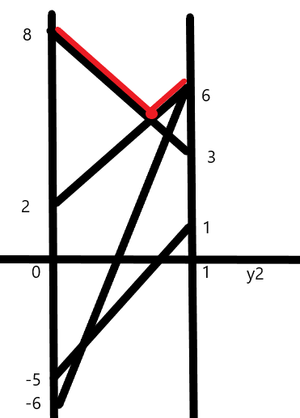
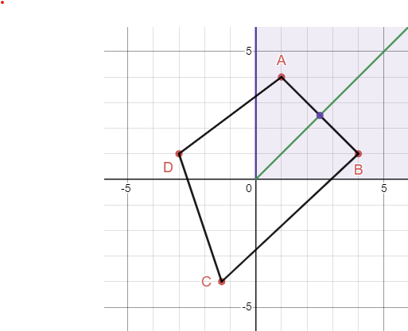
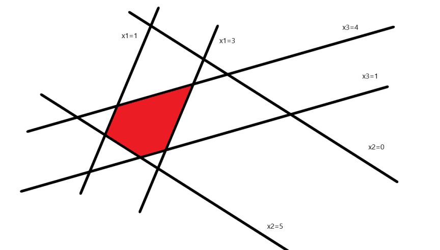

<h1 style="text-align:center;">Теория на игрите</h1>

## Теория

***Дефиниция: (равновесие по Неш)*** Нека $x_i \in X_i$ е стратегия на играч $i$ и $P_i(x_1, \dots, x_n) $ е функция на печалба на играч $i$
$(\overline{X_1}, \dots, \overline{X_n}) \text{ е равновесие по Неш} \Longleftrightarrow P_i(\overline{x_i}, \dots,\overline{x_{i-1}},x_i,\overline{x_{i+1}},\dots, \overline{x_n}) \leq P_i(\overline{x_i},\dots, \overline{x_n}) , \forall i=\overline{1,n}$
(тоест никой не би променил най-оптималната си стратегия при фиксирани стратегии на другите играчи)

***Дефиниция: (игра с нулева сума)*** Една игра е с нулева сума, ако за фиксиран вектор от стратегии $X$ е изпълнено, че $\sum_{i=1}^n P_i(x) = 0$
(тоест е затворена система, играчите само си разпределят наградата от собствените залози)

### I Антагонистична игра между двама играчи с нулева сума

Нека $(\overline{x},\overline{y})$ e равновесие по Неш.
$P(x,y)$ - печалбата на първия играч
$Q(x,y)$ - печалбата на втория играч
Понеже играта е с нулева сума, имаме $P(x,y) = - Q(x,y)$

Тогава 
$$ 1) P(\overline{x},\overline{y}) \geq P(x,\overline{y}) \\
2) Q(\overline{x},\overline{y}) \geq Q(\overline{x},y) \\
-P(\overline{x},\overline{y}) \geq -P(\overline{x},y) \\
P(\overline{x},\overline{y}) \leq P(\overline{x},y)$$

$\Longrightarrow P(x,\overline{y}) \leq P(\overline{x},\overline{y}) \leq P(\overline{x},y)$
(това е условие за седлова точка - max по х, min по y)

Ако имаме матрична игра с матрица $A=(a_{ij})_{m\times n}$, то $a_{ij} = P(x_i,y_j)$

***Дефиниция: (цена на игра)*** 
$$v_{II} = \min_{y \in Y}(\max_{x \in X} P(x,y))\\
v_{I} = \max_{x \in X}(\min_{y \in Y} P(x,y))$$

Ако $v_{II} = v_{I} = v$, то $v$ е цена на играта и $v=P(\overline{x},\overline{y})$
$v$ е гарантираната печалба на първия играч.

***Твърдение:*** $v_{I} \leq v_{II}$

Фиксираме $x_0 \in X, y_0 \in Y$ и тогава е вярно, че
$$P(x_0,y) \leq P(x_0,y_0) \leq P(x,y_0)\\
\min_{y\in Y}P(x_0,y) \leq P(x_0,y_0) \leq \max_{x \in X}P(x,y_0)\\
\min_{y\in Y}P(x,y) \leq \max_{x \in X}P(x_0,y)\\
\max_{x_0 \in X}(\min_{y\in Y}P(x,y)) \leq \min_{y_0 \in Y}(\max_{x \in X}P(x_0,y))\\
v_{I} \leq v_{II}$$

***Твърдение:*** Една игра има цена тогава и само тогава когато има седлова точка (равновесие по Неш)

#### Смесени стратегии

Може при фиксирани стратегии играта да няма равновесие, тоест играчите да не могат да си изберат стратегия, с която да играят всеки път.

При смесените стратегии, всяка от наличните стратегии се избира с вероятност.

Например, ако $x=(\frac{1}{2},\frac{1}{3},\frac{1}{6},0)$ е стратегията на първия играч, то това означава, че той ще играе първата стратегия с вероятност 1/2, втората стратегия с вероятност 1/3, третата с вероятност 1/6 и четвъртата няма да играе никога.

Трябва задължително за даден вектор с вероятности за стратегия на играч да е изпълнено, че $\sum_{x=1}^n x_i=1$ и $x_i \geq 0$

Чиста стратегия $i$ е еквивалентно на записано със смесени стратегии $x=(0,\dots,0,1,0,\dots,0)$ тоест $x_i = 1, x_j = 0$ 

Тогава имаме, че $P(x,y) = \sum_{i=1}^m \sum_{j=1}^n a_{ij} x_i y_j$

Записът $P(x,j)$ означава смесена стратегия $x$ на първия играч и чиста стратегия $j$ на втория.

***Свойство:*** 
Ако $\overline{x_{i_0} }\gt 0 \Longrightarrow P(i_0,\overline{y}) = P(\overline{x},\overline{y}) = v$
Ако $\overline{y_{j_0} }\gt 0 \Longrightarrow P(\overline{x},j_0) = P(\overline{x},\overline{y}) = v$

***Свойство:*** 
Ако $(\overline{x_1},\overline{y_1})$ и $(\overline{x_2},\overline{y_2})$ са равновесия по Неш, то $P(\overline{x_1},\overline{y_1})=P(\overline{x_1},\overline{y_2}) = P(\overline{x_2},\overline{y_1}) = P(\overline{x_2},\overline{y_2})$

***Свойство:*** Всяка игра в смесени стратегии има цена.

#### Симетрични игри

$a_{ij} = - a{ji} \rightarrow a_{ii} = 0$

***Свойство:***  Цената на симетрична игра винаги е 0

***Свойство:***  Равновесието на Неш на симетрична игра е от вида  $(\overline{x},\overline{x})$

#### Правило за премахване на ред и стълб

Ако фиксираме ред $i_0$ и за произволни $\alpha_i$ е изпълнено, че 

$\begin{cases} \sum \alpha_i a_i \geq a_{i_0}\\ \sum \alpha_i =1 \\ \alpha_i \geq 0 \end{cases}$

то можем да премахнем ред $i_0$ ($a_{i_0}$), тоест $\overline{x_{i_0}} = 0$

Ако фиксираме стълб $j_0$ и за произволни $\beta_i$ е изпълнено, че 

$\begin{cases} \sum \beta_i b_i \leq b_{j_0}\\ \sum \beta_i =1 \\ \beta_i \geq 0 \end{cases}$

то можем да премахнем стълб $j_0$ ($b_{j_0}$), тоест $\overline{y_{j_0}} = 0$

### II Антагонистична игра между двама играчи  - биматрична игра

Имаме $A_{m\times n}, B_{m\times n}$
Нека $P(x,y) $ e функция на печалба на първия играч
Нека $Q(x,y) $ e функция на печалба на втория играч

***Дефиниция: (равновесие по Неш)*** $(\overline{x}, \overline{y})$ е равновесие по Неш, ако
$$ 1) P(\overline{x},\overline{y}) \geq P(x,\overline{y}) \\
2) Q(\overline{x},\overline{y}) \geq Q(\overline{x},y)$$
където 
$P(x,y) = x^TAy = \sum_{i=1}^m \sum_{j=1}^n a_{ij} x_i y_j$
$Q(x,y) = x^TBy = \sum_{i=1}^m \sum_{j=1}^n b_{ij} x_i y_j$

### III Кооперативни игри с двама играчи - биматрични

Заедно избират какви стратегии да играят, за да максимизират печалбата си.

$$ \begin{pmatrix} P(x,y) \\ Q(x,y) \end{pmatrix} = \sum_{i=1}^m \sum_{j=1}^n \begin{pmatrix} a_{ij} \\ b_{ij} \end{pmatrix} x_i y_j = \sum_{i,j} p_{ij} \begin{pmatrix}  a_{ij} \\ b_{ij} \end{pmatrix}$$

Нека $S$ е затворено изпъкнало множество, образувано от линиите, свързващи точките $\{(a_{ij},b_{ij})\}$ от матриците $A$ и $B$ на двамата играчи
Нека $$v^* = \min_{y \in Y}(\max_{x \in X} Q(x,y)) \text{ и } u^* = \max_{x \in X}(\min_{y \in Y} P(x,y))$$

Тогава $(\overline{u},\overline{v})$ e решение на $(S,(u^*,v^*))$ и притежава следните свойства:

- $(\overline{u},\overline{v}) \in S$
- $(\overline{u},\overline{v}) \geq (u^*,v^*)$
- $ \nexists(u,v)\in S : \begin{cases} u \gt \overline{u} \\ v \gt \overline{v}\end{cases}$
- ако $(\overline{u},\overline{v}) \in T \subset S$ е решение на $(S,u^*,v^*)$, но е решение и на $(T,u^*,v^*)
- ако $L(u,v)=(u',v')$ - положителна биективна линейна трансформация, то щом $(\overline{u},\overline{v})$ e решение на $(S,(u^*,v^*))$, значи $L(\overline{u},\overline{v})$ e решение на $(L(S),L(u^*,v^*))$
- $(u,v) \in S \rightarrow (v,u) \in S$, решението на $(S,(u^*,u^*))$ е от вида $(\overline{u},\overline{u})$

Съществува единствена точка, която удовлетворява горните свойства и е решение на задачата
$\begin{cases} (u-u^*)(v-v^*) \rightarrow \max \\ u\geq u^* \\ v\geq v^*  \\ (u,v)\in S \end{cases}$

### IV Кооперативни игри с повече от двама играчи

$N=\{1,\dots, n\}$ - играчи
***Дефиниция: (коалиция)*** Произволно непразно подмножество $S$ на $N$ се нарича коалиция.

***Дефиниция: (характеристична функция)*** $v$ е характеристична функция на игра с $n$ играчи, дефинирана от подмножество на $N$ като $\forall S \subseteq N $ показва максималната цена на игра с двама играчи $S$ и $N \setminus S$

$$v(S) = \max_{x \in S} \min_{y \in N \setminus S} P(x,y)$$

***Свойство:***  Характеристичната функция $v(S)$ има следните свойства:
- $v(\emptyset) = 0$
- $v(S \cup T) \geq v(S) + v(T)$ ако $S \cap T = \emptyset$

***Дефиниция: (делба)*** Делба на игра с $n$ играчи е вектор $x \in \mathbb{R}^n$, показващ на кой играч колко ще дадем и има свойствата $\begin{cases} x_i \geq v(\{x_i\}) \\ \sum_{i=1}^n x_i = v(N) \end{cases}$

***Дефиниция:*** $\Delta(v)$ е множеството от делбите за дадена игра 

***Дефиниция: (симетрична игра)*** $v$ не зависи от елементите на коалицията, а само от броя им

***Дефиниция: (симетрична игра)*** $v$ не зависи от елементите на коалицията, а само от броя им

***Дефиниция: (доминирана делба)*** делбата $x$ е по-лоша от делбата $y$ за членовете на коалицията $S$ и казваме, че $x$ се доминира от $y$ : $x <_S y$, ако $x_i < y_i, i\in S$ и $\sum_{i \in S} y_i \leq v(S)$ 

***Дефиниция: (ядро на игра)*** Всички недоминируеми делби: $x \in C(v) \Leftrightarrow \nexists y >_S x$

***Дефиниция: (проста игра)*** Една игра е проста, ако $v(S) \in \{0,1\} \forall S \subseteq R$

***Дефиниция: (изоморфни игри)*** Две игри $u$ и  $v$ са изоморфни, ако съществуват биекция $f: E(u) \rightarrow E(v)$, такива, че  за всяко $x \in E(u) \ni E(v)$ и $S \subset N$ имаме $y>_S x \Longleftrightarrow f(y) >_S f(x)$

***Дефиниция: (еквивалентни игри)*** Две игри $u$ и  $v$ са еквивалентни, ако съществуват $r>0, \alpha_1,\dots,\alpha_n$, такива, че $v(S) = r. u(S) + \sum_{i \in S} \alpha_i$ за всяка коалиция $S \subseteq N$ 

***Дефиниция: (нормализирана игра)*** Играта $v$ е в $(0,1)$ нормализация, ако $v(\{i\})=0, v(N)=1$

***Теорема: (условие за  ядро)*** $x \in C(u) \Longleftrightarrow \sum_{i \in S} x_i \geq u(S)$ за $S \subset N$ и $\sum_{i=1}^n x_i = u(N)$

***Дефиниция: (съществена игра)*** Една игра е съществена, ако $v(N) \gt \sum_{i=1}^n v(\{i\})$

***Дефиниция: (игра с постоянна сума)*** Една игра е с постоянна сума (или още нулева), ако $v(N) = v(S) + v(N \setminus S)$

***Твърдение:***  Ядрото на всяка симетрична игра е празно

***Твърдение:***  Ядрото на всяка съществена игра с постоянна сума е празно

***Твърдение:***  Всяка съществена игра е еквивалентна на точно една (0,1)-нормализирана игра

***Дефиниция: (носител на игра)*** Една коалиция $T$ е носител на играта $v$, ако $v(S) = v(S \cap T)$ за произволна коалиция $S$

## Задачи

#### Антагонистична игра между двама играчи с нулева сума

###### Пример 1

От всеки ред търсим минималното, после избираме максималното
От всеки стълб търсим максималното, после избираме минималното
$$\text{  }\text{  }\text{  }\text{  }\begin{pmatrix} 10 & 17 \\ 9 & 23 \end{pmatrix} \begin{matrix} \underline{10} \\ 9 \end{matrix} \\ \begin{matrix} \underline{10} & 23 \end{matrix}$$
Тъй като двете са равни, то това е равновесие по Неш. Тоест имаме равновесие в чисти стратегии $(1,1)$ и $P(1,1) = 10$. Равновесните стратегии са редът и стълбът, за които се получава равновесната стойност. Цената на играта е намерената обща стойност.

###### Пример 2

$$\text{  }\text{  }\text{  }\text{  }\begin{pmatrix} -1 & 1 \\ 1 & -1 \end{pmatrix} \begin{matrix} \underline{-1} \\ \underline{-1} \end{matrix} \\ \begin{matrix} \underline{1} & & \underline{1} \end{matrix}$$

Тук понеже подчертаните стойности не са равни, нямаме равновесие в чисти стратегии. Търсим в смесени, защото винаги има. $X$ избира ред, тоест за фиксирано $х$ в чиста стратегия, $P(i,y)$ е ред $i$ умножен покомпонентно с $y$. За $Y$ аналогично 

Решаваме системите:
$$\begin{cases} P(1,\overline{y}) = v \\ P(2,\overline{y}) = v \\ \overline{y_1} + \overline{y_2} = 1 \\ \overline{y_1},\overline{y_2} \gt 0\end{cases} \Longleftrightarrow \begin{cases} -\overline{y_1} + \overline{y_2} = v \\ \overline{y_1} - \overline{y_2} = v \\ \overline{y_1} + \overline{y_2} = 1 \\ \overline{y_1},\overline{y_2} \gt 0\end{cases} \Longleftrightarrow \begin{cases} \overline{y_1} = \frac{1}{2} \\ \overline{y_2} = \frac{1}{2} \\ v=0 \end{cases}$$

Аналогичната система и за $x_1,x_2$

Окончателно, равновесието по Неш е $((\frac{1}{2},\frac{1}{2}),(\frac{1}{2},\frac{1}{2}))$ и цената $v=0$

###### Пример 3

$$\text{  }\text{  }\text{  }\text{  }\begin{pmatrix} -3 & 5 \\ 7 & 1 \end{pmatrix} \begin{matrix} -3 \\ \underline{1} \end{matrix} \\ \begin{matrix} 7  & \underline{5} \end{matrix}$$

Нямаме равновесие в чисти стратегии.

Решаваме системите:
$$\begin{cases} P(1,\overline{y}) = v \\ P(2,\overline{y}) = v \\ \overline{y_1} + \overline{y_2} = 1 \\ \overline{y_1},\overline{y_2} \gt 0\end{cases} \Longleftrightarrow \begin{cases} -3\overline{y_1} + 5\overline{y_2} = v \\ 7\overline{y_1} + \overline{y_2} = v \\ \overline{y_1} + \overline{y_2} = 1 \\ \overline{y_1},\overline{y_2} \gt 0\end{cases}$$

Аналогичната система и за $x_1,x_2$ и получаваме равновесието.

###### Пример 4

$$\text{  }\text{  }\begin{pmatrix} 1 & 4 & 7 & 2 \\ 2 & 3 & 3 & 1 \end{pmatrix} \begin{matrix} \underline{1} \\ \underline{1} \end{matrix} \\ \begin{matrix} \underline{2} & 4 & 7 & \underline{2} \end{matrix}$$

Нямаме равновесие в чисти стратегии

Понеже тук първият играч $Х$ има две възможни стратегии, параметризираме по $x$ и избираме $x_2$. Правим чертеж, максимално точен, като свързваме двете стойности от всяка колона. След това понеже параметризираме по $х$, гледаме коя е най-високата точка в най-долната линия. Така намираме стойността за $x_2$, откъдето $х_1=x_2-1$. Височината на тази точка е цената на играта. От това кои линии сме взели като най-долна се ориентираме кои са y-ците, които отговарят на тези линии. Всички други $y_j = 0$.  За тези $у$, които са останали можем да решим система и да ги намерим. Нагледно: 

От тук виждаме, че $x_2=\frac{1}{2}$ откъдето $x_1=\frac{1}{2}. Също така $v=\frac{3}{2}.
Виждаме че линиите за $у_2$ и $у_3$ не влизат във финалната ни линия, тоест $у_2=y_3=0$. Остана да намерим $у_1$ и $у_4$.

Решаваме системата:
$$\begin{cases} P(1,\overline{y}) = v \\ P(2,\overline{y}) = v \\ \overline{y_1} + \overline{y_4} = 1 \\ \overline{y_1},\overline{y_4} \gt 0\end{cases} \Longleftrightarrow \begin{cases} \overline{y_1} + 2\overline{y_4} = \frac{3}{2} \\ 2\overline{y_1} - \overline{y_4} = \frac{3}{2} \\ \overline{y_1} + \overline{y_4} = 1 \\ \overline{y_1},\overline{y_4} \gt 0\end{cases} \Longleftrightarrow \begin{cases} \overline{y_1} = \frac{1}{2} \\ \overline{y_4} = \frac{1}{2} \end{cases}$$

Окончателно, равновесието по Неш е $((\frac{1}{2},\frac{1}{2}),(\frac{1}{2},0,0,\frac{1}{2}))$ и цената $v=\frac{3}{2}$

###### Пример 5

$$\text{  }\text{  }\begin{pmatrix} 2 & 6 \\ 8 & 3 \\ -5 & 1 \\ -6 & 6 \end{pmatrix} \begin{matrix} 2 \\ \underline{3} \\ -5 \\ -6 \end{matrix} \\ \begin{matrix} 8 & \underline{6} \end{matrix}$$

Нямаме равновесие в чисти стратегии

Понеже тук вторият играч $Y$ има две възможни стратегии, параметризираме по $y$ и избираме $y_2$. Правим чертеж, максимално точен, като свързваме двете стойности от всеки ред. След това понеже параметризираме по $y$, гледаме коя е най-ниската точка в най-горната линия. Така намираме стойността за $y_2$, откъдето $y_1=y_2-1$. От това кои линии сме взели като най-горна се ориентираме кои са x-овете, които отговарят на тези линии. Всички други $x_i = 0$.  За тези $x$, които са останали можем да решим система и да ги намерим. Нагледно: 

От тук виждаме, че $y_2=\frac{2}{3}$ откъдето $y_1=\frac{1}{3}$. Също така $v=\frac{14}{3}$.
Виждаме че линиите за $x_3$ и $x_4$ не влизат във финалната ни линия, тоест $x_3=x_4=0$. Остана да намерим $x_1$ и $x_2$.

Решаваме системата:
$$\begin{cases} P(\overline{x},1) = v \\ P(\overline{x},2) = v \\ \overline{x_1} + \overline{x_2} = 1 \\ \overline{x_1},\overline{x_2} \gt 0\end{cases} \Longleftrightarrow \begin{cases} 2\overline{x_1} + 8\overline{x_2} = \frac{14}{3} \\ 6\overline{x_1} + 3\overline{x_2} = \frac{14}{3} \\ \overline{x_1} + \overline{x_2} = 1 \\ \overline{x_1},\overline{x_2} \gt 0\end{cases} \Longleftrightarrow \begin{cases} \overline{x_1} = \frac{5}{9} \\ \overline{x_2} = \frac{4}{9} \end{cases}$$

Окончателно, равновесието по Неш е $((\frac{5}{9},\frac{4}{9},0,0),(\frac{1}{3},\frac{2}{3}))$ и цената $v=\frac{14}{3}$

###### Пример 6

$$\text{  }\text{  }\begin{pmatrix} 0 & 1 & -2 \\ -1 & 0 & 3 \\ 2 & -3 & 0 \end{pmatrix} \begin{matrix} 2 \\ \underline{-1} \\ 3  \end{matrix} \\ \begin{matrix} 2 &&  \underline{1} & & 3\end{matrix}$$

Няма равновесие в чисти стратегии. Понеже играта е симетрична, търсим равновесие от вида $(x,x)$ и знаем че цената е $0$, заради симетричността.

Първо гледаме дали е възможно да има стратегия, която със сигурност не играем($x_i=0$)

Нека без ограниечение на общността $$\begin{cases} \overline{x_3} = 0 \\ \overline{x_1} \gt 0 \\ \overline{x_2} \gt 0 \end{cases} \Longrightarrow \begin{cases} P(1,\overline{x}) = 0 \\ P(2,\overline{x}) = 0 \end{cases} \Longleftrightarrow \begin{cases} 0\overline{x_1} + 1\overline{x_2} - 2\overline{x_3} = 0 \\ -\overline{x_1} + 0\overline{x_2} + 3\overline{x_3} = 0 \end{cases} \Longleftrightarrow  \begin{cases} \overline{x_1} = 0 \\ \overline{x_2} =0 \\ \overline{x_3} = 0 \end{cases}$$

Следователно, този случай не е възможен и гледаме да няма нито един $x_i=0$

$$\begin{cases} P(1,\overline{x}) = 0 \\ P(2,\overline{x}) = 0 \\ P(3,\overline{x}) = 0 \end{cases} \Longleftrightarrow  \begin{cases} \overline{x_1} = \frac{1}{2} \\ \overline{x_2} = \frac{1}{3} \\ \overline{x_3} = \frac{1}{6} \end{cases}$$

Окончателно, равновесието по Неш е $((\frac{1}{2},\frac{1}{3},\frac{1}{6}),(\frac{1}{2},\frac{1}{3},\frac{1}{6}))$ и цената $v=0$

###### Пример 7

$$ A = \begin{pmatrix} 9 & 10 & 11 \\ 10 & 11 & 9 \\ 11 & 9 & 10 \end{pmatrix} \begin{matrix} \underline{9} \\ \underline{9} \\ \underline{9}  \end{matrix} \\ \text{  }\text{  } \text{  }\text{  } \text{  }\text{  } \begin{matrix} \underline{11} &  \underline{11} & \underline{11}\end{matrix}$$

Няма равновесие в чисти стратегии. 

Можем да опростим играта като направим $B = A - 10$

$$ B = \begin{pmatrix} -1 & 0 & 1 \\ 0 & 1 & -1 \\ 1 & -1 & 0 \end{pmatrix} $$

Сега можем да разменим първия и втория ред на матрицата и получаваме

$$ C = \begin{pmatrix}    0 & 1 & -1 \\ -1 & 0 & 1 \\ 1 & -1 & 0 \end{pmatrix} $$

Сега получихме симетрична игра, която знаем как да решим

Като намерим за нея $\overline{x} = (\overline{x_1},\overline{x_2},\overline{x_3})$ то за да получим $\overline{x}$ за играта $B$ разменяме стойностите на $\overline{x_1},\overline{x_2}$. За да намерим окончателното решение на дадената игра, трябва да намерим цената спрямо стойностите на дадената матрица с вече намерената стойност на $\overline{x}$

###### Пример 8

$$ A = \begin{pmatrix} 144 & 60 & 84 \\ 60 & 144 & 124 \\ 84 & 112 & 110 \\ 70 & 126 & 116 \end{pmatrix}$$

Няма равновесие в чисти стратегии. 

Можем да опростим играта като премахнем редове и колони.
Ако дадена изпъкнала комбинация на редове (всеки ред умножаваме с неотрицателна константа, като сбора на всички константи е 1) мажорира (e по-голям от) даден ред, то можем да го махнем.

В случая, $\frac{1}{2} a_2 + \frac{1}{2} a_3 \geq a_4$ (сравняваме покомпонентно), понеже се полува $(72,128,117) \geq (70,126,116)$
Тоест можем да премахнем четвъртия ред ($\overline{x_4} = 0$)

$$ B = \begin{pmatrix} 144 & 60 & 84 \\ 60 & 144 & 124 \\ 84 & 112 & 110\end{pmatrix}$$

Сега имаме, че $\frac{1}{3} a_1 + \frac{2}{3} a_2 \geq a_3$ (сравняваме покомпонентно), понеже се полува $(88,116,110) \geq (84,112,110)$
Тоест можем да премахнем третия ред ($\overline{x_3} = 0$)

$$ B = \begin{pmatrix} 144 & 60 & 84 \\ 60 & 144 & 124 \end{pmatrix}$$

Сега искаме да махнем някой стълб, въпреки че и в този вид вече можем да я решим играта. За целта искаме да намерим стълб, който е по-малък от изпъкнала комбинация на другите стълбове.

Имаме, че $\frac{1}{4}b_1 + \frac{3}{4}b_2 \leq b_3$, понеже $(81,123) \leq (84,124)$, тоест можем да махнем третия стълб ($\overline{y_3} = 0$)

$$ C = \begin{pmatrix} 144 & 60 \\ 60 & 144 \end{pmatrix}$$

Сега получихме едновременно 2х2 игра, която е и симетрична игра, която знаем как да решим.

#### Антагонистична игра между двама играчи - биматрична игра

###### Пример 1

Когато имаме две матрици, винаги по матрицата на първия играч търсим max по стълбове, а по матрицата на втория играч max по редове

$$A=\begin{pmatrix} 1 & \underline{7} & 1 \\ \underline{4} & 6 & \underline{6} \end{pmatrix} , B = \begin{pmatrix}  \underline{3} & 2 & 0 \\ 0 & 2 & \underline{3} \end{pmatrix}$$

Тъй като има съвпадащи подчертани елементи в двете матрици, то имаме равновесие в чисти стратегии, а именно $(2,3)$ и печалбата на първия играч е $v=6 = P(2,3)$, а на втория $w=3=Q(2,3)$

###### Пример 2

Когато имаме две матрици, винаги по матрицата на първия играч търсим max по стълбове, а по матрицата на втория играч max по редове

$$A=\begin{pmatrix} 1 & \underline{7} & \underline{3} \\ \underline{4} & 5 & 1 \end{pmatrix} , B = \begin{pmatrix}  \underline{3} & 2 & 0 \\ 0 & 2 & \underline{3} \end{pmatrix}$$

Нямаме равновесие в чисти стратегии.

Първият играч има 2 стратегии $x=(x_1,x_2)$, а вторията има 3 стратегии $y=(y_1,y_2,y_3)$

Затова параметризираме по $х$ и избираме $х_2$. Тогава на чертеж слагаме стойностите от матрицата $B$, тоест $Q(x,j)$

Нагледно:

Още от чертежа е ясно, че възможните стойности за $х_2$ са $\frac{1}{3}$ и $\frac{2}{3}$. Но трябва формално да разгледаме трите интервала и двете крайни стойности и да кажем, че там няма решения.

1) Да разгледаме сега първо случая $\overline{x}=(\frac{1}{3},\frac{2}{3})$ От тук директно следва от чертежа, че $\overline{y_1} = 0$ и $\overline{y_2},\overline{y_2} \gt 0$
Сега можем да премахнем първия стълб на $A$ и остава $A=\begin{pmatrix}  7 & 3 \\ 5 & 1 \end{pmatrix}$ 
Решаваме системата $$\begin{cases} P(1,\overline{y}) = v \\  P(2,\overline{y}) = v \end{cases} \Longleftrightarrow \begin{cases} 7y_2 + 3y_3 = v \\ 5y_2 + y_3 = v \end{cases}  \Longleftrightarrow \begin{cases} \overline{y_2} = 0 \\ \overline{y_3} = 0\end{cases} \rightarrow \text{невъзможно}$$
Следователно това не е ревновесие по Неш

2) Сега да разгледаме случая $\overline{x}=(\frac{2}{3},\frac{1}{3})$ От тук директно следва от чертежа, че $\overline{y_3} = 0$ и $\overline{y_1},\overline{y_2} \gt 0$
Сега можем да премахнем третия стълб на $A$ и остава $A=\begin{pmatrix}  1 & 7 \\ 4 & 5 \end{pmatrix}$ 
Решаваме системата $$\begin{cases} P(1,\overline{y}) = v \\  P(2,\overline{y}) = v \end{cases} \Longleftrightarrow \begin{cases} y_1 + 7y_2 = v \\ 5y_1 + y_2 = v \end{cases}  \Longleftrightarrow \begin{cases} \overline{y_1} = \frac{2}{5} \\ \overline{y_2} = \frac{3}{5} \\ v=\frac{23}{5} \end{cases} \rightarrow \text{равновесие}$$
Следователно това е ревновесие по Неш

Остана да сметнем печалбата на втория играч. Понеже $\overline{y_1}>0$, то имаме, че $Q(\overline{x},1) = w $. Тоест $\frac{2}{3} \cdot 3 + \frac{1}{3} \cdot 0 = w = 2$

Окончателно, равновесието е $((\frac{2}{3},\frac{1}{3}),(\frac{2}{5},\frac{3}{5},0))$ и $v=\frac{23}{5}, w=2$

3) Сега да разгледаме формалните интервали и стойности

    - При $x_2 = 0$ имаме, че $x_1 = 1$ и тогава втория играч ще играе винаги първата стратегия, тоест получаваме равновесие в чисти стратегии - противоречие
    - При $x_2 = 1$ - аналогично
    - При $x_2 \in (0,\frac{1}{3})$ имаме от чертежа, че $\overline{y}=(1,0,0)$. Тогава щом $\overline{x_1},\overline{x_2}>0$ е вярно, че $\begin{cases} P(1,\overline{y}) = v \\ P(2,\overline{y}) = v\end{cases} \Longleftrightarrow \begin{cases} v = 1 \\ v = 4 \end{cases} \rightarrow \text{противоречие}$
    - Аналогично при $x_2 \in (\frac{1}{3},\frac{2}{3})$ и  $x_2 \in (\frac{2}{3},1)$

- *Забележка*: навсякъде системите имат и другите две условия че сборът на елементите на вектора е точно 1 и всеки компонент на вектора е по-голям или равен на нула

###### Пример 3

Когато имаме две матрици, винаги по матрицата на първия играч търсим max по стълбове, а по матрицата на втория играч max по редове

$$A=\begin{pmatrix} \underline{5} & 0 \\ 3 & 3 \\ 0 & \underline{5} \end{pmatrix} , B = \begin{pmatrix}  1 & \underline{2} \\ 3 & \underline{4} \\ \underline{4} & 1 & \end{pmatrix}$$

Нямаме равновесие в чисти стратегии.

Вторията играч има 2 стратегии $y=(y_1,y_2)$, а пъвият има 3 стратегии $x=(x_1,x_2,x_3)$

Затова параметризираме по $y$ и избираме $y_2$. Тогава на чертеж слагаме стойностите от матрицата $A$, тоест $P(i,y)$

***Чертежът е аналогичен с този от предната задача*** - оста само е по y2, и вместо 0,2,3 стойностите са 0,3,5 

Още от чертежа е ясно, че възможните стойности за $y_2$ са $\frac{2}{5}$ и $\frac{3}{5}$. Но трябва формално да разгледаме трите интервала и двете крайни стойности и да кажем, че там няма решения.

1) Ако $0 \lt \overline{y_2} \lt \frac{2}{5}$ маме от чертежа, че $\overline{x}=(1,0,0)$, тоест понеже $\overline{y_1},\overline{y_2} \gt 0$ имаме, че $\begin{cases} Q(\overline{x},1) = w \\ Q(\overline{x},1) = w \end{cases} \rightarrow \text{противоречие}$

2) Ако $\frac{2}{5} \lt \overline{y_2} \lt \frac{3}{5}$ маме от чертежа, че $\overline{x}=(0,1,0)$, тоест понеже $\overline{y_1},\overline{y_2} \gt 0$ имаме, че $\begin{cases} Q(\overline{x},1) = w \\ Q(\overline{x},1) = w \end{cases} \rightarrow \text{противоречие}$

3) Ако $\frac{3}{5} \lt \overline{y_2} \lt 1$ маме от чертежа, че $\overline{x}=(0,0,1)$, тоест понеже $\overline{y_1},\overline{y_2} \gt 0$ имаме, че $\begin{cases} Q(\overline{x},1) = w \\ Q(\overline{x},1) = w \end{cases} \rightarrow \text{противоречие}$

4) Ако $\overline{y_2} = 0$, то $\overline{y_1} = 1$ и имаме от чертежа, че $\overline{x}=(1,0,0)$, тоест получаваме чиста стратегия $(1,1)$ - противоречие

5) Ако $\overline{y_2} = 1$, то $\overline{y_0} = 1$ и имаме от чертежа, че $\overline{x}=(0,0,1)$, тоест получаваме чиста стратегия $(3,2)$ - противоречие

6) Ако $\overline{y_2} = \frac{2}{5}$, то $\overline{y}=(\frac{3}{5},\frac{2}{5})$ От тук директно следва от чертежа, че $\overline{x_3} = 0$ и $\overline{x_1},\overline{x_2} \gt 0$
Решаваме системата $$\begin{cases} Q(\overline{x}, 1) = w \\  Q(\overline{x},2) = w \end{cases} \Longleftrightarrow \begin{cases} x_1 + 3x_2 = w \\ 2x_1 + 4x_2 = w \end{cases}  \Longleftrightarrow \begin{cases} \overline{x_1} = 0 \\ \overline{x_2} = 0\end{cases} \rightarrow \text{невъзможно}$$
Следователно това не е ревновесие по Неш

7) Ако $\overline{y_2} = \frac{3}{5}$, то $\overline{y}=(\frac{2}{5},\frac{3}{5})$ От тук директно следва от чертежа, че $\overline{x_1} = 0$ и $\overline{x_2},\overline{x_3} \gt 0$
Решаваме системата $$\begin{cases} Q(\overline{x}, 1) = w \\  Q(\overline{x},2) = w \end{cases} \Longleftrightarrow \begin{cases} 3x_2 + 4x_3 = w \\ 4x_2 + x_3 = w \end{cases}  \Longleftrightarrow \begin{cases} \overline{x_2} = \frac{3}{4} \\ \overline{x_3} = \frac{1}{4} \\ w=\frac{13}{4} \end{cases} \rightarrow \text{равновесие}$$
Следователно това е ревновесие по Неш

Остана да сметнем печалбата на първия играч. Понеже $\overline{x_2}>0$, то имаме, че $P(2,\overline{y}) = v $. Тоест $\frac{2}{5} \cdot 3 + \frac{3}{5} \cdot 3 = v = 3$

Окончателно, равновесието е $((0,\frac{3}{4},\frac{1}{4}),(\frac{2}{5},\frac{3}{5}))$ и $v=3, w=\frac{13}{4}$
    
- *Забележка*: навсякъде системите имат и другите две условия че сборът на елементите на вектора е точно 1 и всеки компонент на вектора е по-голям или равен на нула

#### Кооперативни игри с двама играчи - биматрични

###### Пример 1

Тук е удобно да гледаме двете матрици като една матрица от наредени двойки.

$$\begin{pmatrix} (1,4) & (-\frac{4}{3},-4) \\ (-3,1) & (4,1) \end{pmatrix}$$

Определямае $u_0$ като цената на играта на матрицата

$$ A = \begin{pmatrix} 1 & -\frac{4}{3} \\ -3 & 4 \end{pmatrix}$$
Няма равновесие в чисти стратегии, значи решаваме системата 

$$\begin{cases} x_1 - 3x_2 = v \\ -\frac{4}{3}x_1 + 4x_2 = v \\ x_1 + x_2 = 1 \end{cases}$$
Откъдето получаваме, че $u_0 =v = 0$

Определямае $v_0$ като цената на играта на матрицата

$$ B^T = \begin{pmatrix} 4 & -1 \\ -4 & 1 \end{pmatrix}$$
Няма равновесие в чисти стратегии, значи решаваме система...
Откъдето получаваме, че $v_0 =v = 0$

Окончателно $(u_0,v_0) = (0,0)$

Правим чертеж на множеството $S$, което представлява свързани с прави точките от дадената матрица. Разглеждаме само частта, от него, в която $(u,v) \geq (u_0,v_0) = (0,0)$. Спазвайки шестте аксиоми може да определим решението по 3 начина.

Решението е $(\overline{u},\overline{v}) = (\frac{5}{2},\frac{5}{2})$

Най-лесният е като гледаме чертежа и намерим пресечната точка на ъглополовящата на първи квадрант със страната срещу нея(от симетричността).

Вторият вариант е да намерим решение на системата $\begin{cases} uv \rightarrow \max \\ (u,v) \in S \\ (u,v) \geq (u_0,v_0) \end{cases}$, където u,v са координати удовлетворяващи уравнението на отсечката $AB$, спомената в горния метод ($A + \alpha(B-A)$)
Тогава се получава, че $uv = a\alpha^2 + b \alpha + c$
Когато намерим НГС на тази парабола за $\alpha \in [0,1]$, ще имаме координатите на точката, което е и решението ни.

Третият начин е чрез използване на множители на Лагранж. Тогава решаваме системата  $$\begin{cases} (u-u_0)(v-v_0) \rightarrow \max \\ au+bv=c \text{  (гореспоменатата отсечка)} \\ (u,v) \geq (u_0,v_0)\end{cases}$$
Това се свежда до намиране на екстремум на $\mathbb{L}(u,v,\lambda)=(u-u_0)(v-v_0) + \lambda(au+bv-c)$. Решаваме като занулим едновременно частине производни по трите променливи. При намерените стойности, намираме и търсеното решение.

###### Пример 2

$$\begin{pmatrix} (2,1) & (-1,-1) \\ (-1,-1) & (1,2) \end{pmatrix}$$

Определямае $u_0$ като цената на играта на матрицата $ A = \begin{pmatrix} 2 & -1 \\ -1 & 1 \end{pmatrix}$
Няма равновесие в чисти стратегии, значи решаваме системата $\begin{cases} 2x_1 - x_2 = v \\ -x_1 + x_2 = v \\ x_1 + x_2 = 1 \end{cases}$
Откъдето получаваме, че $u_0 = v = \frac{1}{5}$

Определямае $v_0$ като цената на играта на матрицата $ B^T = \begin{pmatrix} 1 & -1 \\ -1 & 2 \end{pmatrix}$
Няма равновесие в чисти стратегии, значи решаваме системата  $\begin{cases} x_1 - x_2 = v \\ -x_1 + 2x_2 = v \\ x_1 + x_2 = 1 \end{cases}$
Откъдето получаваме, че $v_0 = v = \frac{1}{5}$

Окончателно $(u_0,v_0) = (\frac{1}{5},\frac{1}{5})$

Правим чертеж на множеството $S$, което представлява свързани с прави точките от дадената матрица. Разглеждаме само частта, от него, в която $(u,v) \geq (u_0,v_0) = (\frac{1}{5},\frac{1}{5})$. Спазвайки шестте аксиоми може да определим решението по 3 начина.

Решението е $(\overline{u},\overline{v}) = (\frac{3}{2},\frac{3}{2})$

Най-лесният е като гледаме чертежа и намерим пресечната точка на ъглополовящата на първи квадрант със страната срещу нея(от симетричността).

Вторият вариант е да намерим решение на системата $\begin{cases} uv \rightarrow \max \\ (u,v) \in S \\ (u,v) \geq (u_0,v_0) \end{cases}$, където u,v са координати удовлетворяващи уравнението на отсечката $AB$, спомената в горния метод ($A + \alpha(B-A)$)
Тогава се получава, че $uv = a\alpha^2 + b \alpha + c$
Когато намерим НГС на тази парабола за $\alpha \in [0,1]$, ще имаме координатите на точката, което е и решението ни.

Третият начин е чрез използване на множители на Лагранж. Тогава решаваме системата  $$\begin{cases} (u-u_0)(v-v_0) \rightarrow \max \\ au+bv=c \text{  (гореспоменатата отсечка)} \\ (u,v) \geq (u_0,v_0)\end{cases}$$
Това се свежда до намиране на екстремум на $\mathbb{L}(u,v,\lambda)=(u-u_0)(v-v_0) + \lambda(au+bv-c)$. Решаваме като занулим едновременно частине производни по трите променливи. При намерените стойности, намираме и търсеното решение.

#### Кооперативни игри с повече от двама играчи

###### Пример 1

Имаме играта $u$, дефинирана с характеристичната си функция и $N=\{1,2,3\}$ : $\begin{cases} u(\{i\}) = -2 \\ u(\{i,j\}) = 2\\ u(N) = 0 \end{cases}$

Искаме да направим (0,1)-нормализация на играта

За целта ползваме следните две формули:
- $r = \dfrac{1}{u(N)-\sum_{i \in N} u(\{i\})}$
- $\alpha_i = - u(\{i\}) \cdot r$
- $v(S) = r\cdot u(S) + \sum_{i \in S} \alpha_i$

За конкретната задача, имаме:

- $r = \frac{1}{0 - 3\cdot(-2)} = \frac{1}{6}$
- $\alpha_i = -(-2)\cdot \frac{1}{6} = \frac{1}{3}$

Тогава получаваме:

- $v(\{i\}) = r \cdot u(\{i\}) + \alpha_i = 0$ - само за проверка(за всяка нормализирана игра едноелементните коалиции се характеризират с 0)
- $v(\{i,j\}) = r \cdot u(\{i,j\}) + \alpha_i + \alpha_j = 1$ 
- $v(N) = r \cdot u(N) + \alpha_1 + \alpha_2 + \alpha_3 = 1$ - само за проверка(за всяка нормализирана игра съвместната коалиция се характеризира с 1)

Окончателно, нормализираната игра е $\begin{cases} v(\{i\}) = 0 \\ v(\{i,j\}) = 1\\ v(N) = 1 \end{cases}$

###### Пример 2

Имаме играта $v$, дефинирана с характеристичната си функция и $N=\{1,2\}$ : $\begin{cases} v(\{1\}) = 1 \\ v(\{2\}) = 2 \\ v(\{1,2\}) = 5 \end{cases}$

Търсим ядрото на играта.

За да намерим ядрото, винаги разглеждаме геометричния обект, зададен като сума на измеренията и равен на $v(N)$. В този случай имаме $N=2$ затова сме в 2d и разглеждаме права. След това за всеки компонент образуван от сбора на измеренията на коалицията $S$ слагаме ограничения да е по-голям от $v(S)$

Имаме, че $C(v)=\{(x,y) \in \mathbb{R}^2 | x+y=5, x\geq 1, y \geq 2 \}$

На чертеж:

###### Пример 3

Имаме играта $v$, дефинирана с характеристичната си функция и $N=\{1,2,3\}$ : $\begin{cases} v(\{1\}) = 1 , v(\{2\}) = 0 ,v(\{3\}) = 1\\ v(\{1,2\}) = 4,v(\{1,3\}) = 3,v(\{2,3\}) = 5\\ v(\{1,2,3\}) = 8 \end{cases}$

Търсим ядрото на играта.

За да намерим ядрото, винаги разглеждаме геометричния обект, зададен като сума на измеренията и равен на $v(N)$. В този случай имаме $N=3$ затова сме в 3d и разглеждаме равнина. След това за всеки компонент образуван от сбора на измеренията на коалицията $S$ слагаме ограничения да е по-голям от $v(S)$

Имаме, че 
$\begin{array}{lcl} C(v)=\{(x_1,x_2,x_3) \in \mathbb{R}^3 & | & x_1+x_2+x_3=8,  \\ &  & x_1\geq 1, x_2 \geq 0, x_3 \geq 1, \\ && x_1+x_2 \geq 4 \Rightarrow x_3 \leq 5 \\ && x_1+x_3 \geq 3 \Rightarrow x_2 \leq 5 \\ && x_2+x_3 \geq 5 \Rightarrow x_1 \leq 3 \} \end{array}$

На чертеж - в равнината $ x_1+x_2+x_3=8 $:

###### Пример 4

Имаме играта $v$, дефинирана с характеристичната си функция и $N=\{1,2,3\}$ : $\begin{cases} v(\{1\}) = v(\{2\}) = v(\{3\}) = 1 \\ v(\{1,2\}) = v(\{1,3\})  =v(\{2,3\}) = 1\\ v(\{1,2,3\}) = 1 \end{cases}$

Търсим ядрото на играта.

Ядрото се определя от системата $\begin{cases} x_1+x_2+x_3=1\\ x_1 + x_2 \geq 1 \\ x_1+x_3 \geq 1 \\ x_2 + x_3 \geq 1 || x_1,x_2,x_3 \geq 0 \end{cases} \longrightarrow \text{несъвместима}$

Тоест ядрото е празно и всяка делба е доминируема. Това означава, че играта няма решение. 

###### Пример 5

Имаме играта $v$, дефинирана с характеристичната си функция и $N=\{1,2,3\}$ : $\begin{cases} v(\{1\}) = v(\{2\}) = v(\{3\}) = 0 \\ v(\{1,2\}) = v(\{1,3\})  =v(\{2,3\}) =  \alpha \\ v(\{1,2,3\}) = 1 \end{cases}$

Търсим $\alpha$, такова, че ядрото на играта е непразно.

Ядрото се определя от системата $\begin{cases} x_1+x_2+x_3=1\\ x_1 + x_2 \geq \alpha \\ x_1+x_3 \geq  \alpha \\ x_2 + x_3 \geq  \alpha || x_1,x_2,x_3 \geq 0\end{cases} \Longrightarrow 2(x_1+x_2+x_3) \geq 3\alpha \Longleftrightarrow \alpha \leq \frac{2}{3}$

- При $\alpha \gt \frac{2}{3}$ - ядрото е празно
- При $\alpha = \frac{2}{3}$ - ядрото се състои от една точка $(\frac{1}{3},\frac{1}{3},\frac{1}{3})$
- При $\alpha \lt \frac{2}{3} $ - ядрото се състои от множество - триъгълник